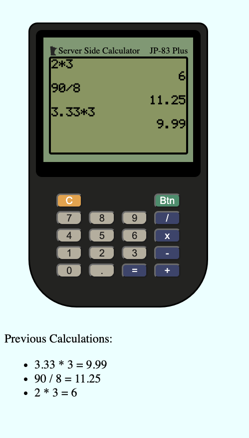

# Server-Side Calculator

## Description

_Duration: Weekend Project_

For this project, I created a basic pocket calculator app which runs in an internet browser. This calculator is able to basic addition, subtraction, multiplication, and division with accuracy up to 6 decimal places. It is able to carry out these calculations on two numbers at a time. I took inspiration from both a basic pocket calculator and a Texas Instruments TI-83 Plus for the operation behavior and styling of the app.

Each calculation is stored locally in a global object on the client side of the app. Client-side Javascript logic limits the user input to guide the user to input a valid calculation. For example, the user is not able to enter two operators in the same calculation. This same series of logic assigns valid user input to a global object, which tracks the user input and stores it as a string. jQuery is used to manipulate the DOM to display calculations. Once the equals sign is press, the global object is sent to the server via a POST request where an answer is calculated.

Once the server recieves the POST request, it uses a function to convert the numbers from the object (stored as strings) to number data types. It then calculates the correct answer using the assigned operator. The output from this function is an object which includes the final answer and the entire calculation, both stored as strings. This object is then pushed to a server-side global array.

A GET request from the client retrieves this array of calculated objects, appends the most recent answer to the DOM calculator, and appends the previous calculations section near the bottom of the page.

## Screen Shot

## Prerequisites

-[Chrome](https://www.google.com/chrome/dr/download/?brand=JJTC&gclid=Cj0KCQjwjvaYBhDlARIsAO8PkE3wJ0J7XPPrHwfdNBjXlHb-UyqQu9PlEV-TwtIusPtTw_jggRyNY0MaAm3IEALw_wcB&gclsrc=aw.ds) or similar up-to-date browser
- [Node.js](https://nodejs.org/en/)

## Installation
1. Ensure you have properly install Node.js
2. Open the project repo in your editor of choice
3. Open your terminal, navigate to the project repo, and run `npm install`
4. In your terminal, run `node ./server/server.js`
5. Open your browser and use the address bar to navigate to `localhost:5000`
6. You should now be able to use the calculator from your browser window

## Built With

1. HTML and CSS
2. Javascript
3. jQuery
4. Node.js
5. Express

## Acknowledgement:
Thanks to Emerging Digital Academy as well as their curriculum partner Prime Digital Academy for providing me with the resources to complete this project.

## Support:
If you have suggestions or issues, please email me at pettitbass@gmail.com

